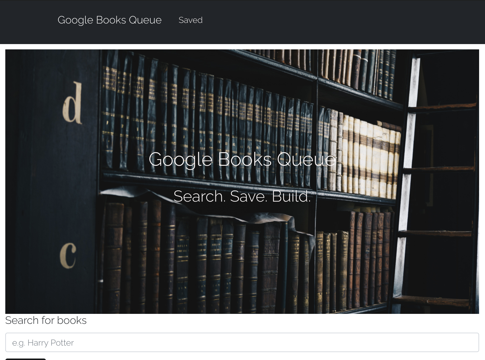
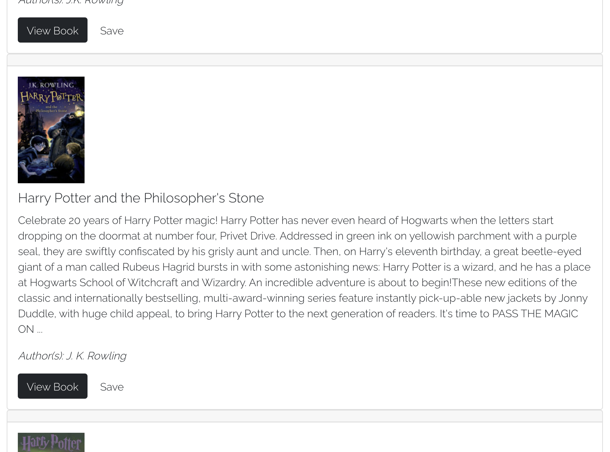

# Google Books Queue

## Table of Contents

* Description
* Installation
* Contributions
* Licensing
* Screenshots
* Questions

## Description

Using Node, Express and MongoDB, this project is a Google Books search queue that allows users to find books of interest and store them for later reference. Saved items can also be discarded when no longer needed. The application utilizes React lifecycle methods to query and display books based on user queries.

## Installation

Users can clone the application in Terminal or code editor of choice, and run 'npm start' in the console to run multiple servers and view in local browser. The application is also deployed at https://bookapigoogle.herokuapp.com/

## Contributions

No parameters required.

## Licensing

## Screenshots

## Questions

* You can follow my repositories at https://www.github.com/jarretebarnett
* For professional inquiries, you can email jarretebarnett@gmail.com